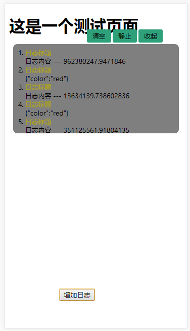

# 用于移动端日志打印

## 引入
在页面引入simulate.min.js，引入后会在window下创建一个Simulate对象

## 使用

### 初始化实例
首先要创建一个Simulate实例

```javaScript
    window.simulate =  new Simulate(options)
```
### options
有一些可配置项

配置项  | 类型  | 默认值 | 作用
:----  |:----  |:----  |:---- 
autoScroll  |  boolean  |false | 日志内容是否滚动
autoOpenContent  |   boolean |false  | 日志面板是否自动打开
wrapperTop |   number   |1       | 日志面板到屏幕顶部的距离
buttonRight |   number   |0.5   | 按钮部分距离屏幕右边的距离
contentHeight |    number  |10   | 日志内容的高度
contentOpacity |   number   |0.5  | 日志内容背景透明度
titleColor |  十六进制、rgb、rgba格式颜色  |'rgb(165, 157, 39)' | 日志标题颜色
logColor |   十六进制、rgb、rgba格式颜色  |'rbg(255,255,255)'      | 日志颜色

### 调用
使用实例中的log方法打印日志，可接受两个参数，一个为日志标题，一个为日志内容
```javaScript
    simulate.log('日志标题' , '日志内容 --- ' + Math.random() * 1000000000);
    simulate.log('日志标题' , {
                    color:'red'
                });
```

### 效果
效果截图如下：


